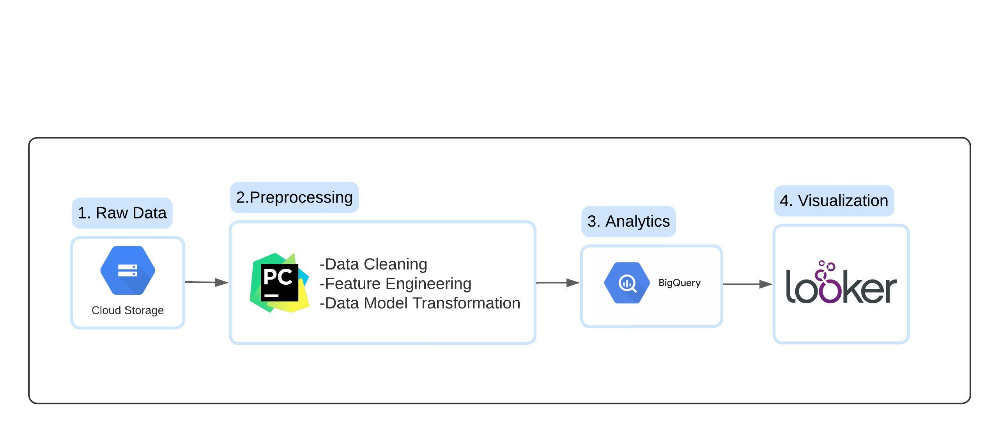

# Motorbike Data Engineering Project

Welcome to the Motorbike Data Engineering project! This repository contains the code and resources related to preprocessing, feature engineering, and analysis of a motorbike dataset. The insights gained from this project are presented through an interactive Looker dashboard.

## Table of Contents
- [Introduction](#introduction)
- [Project Flow](#project-flow)
- [Data Model](#data-model)
- [Data Export to BigQuery](#data-export-to-bigquery)
- [Looker Studio Dashboard](#looker-studio-dashboard)
- [Contributing](#contributing)

## Introduction

This project focuses on the preprocessing, feature engineering, and analysis of a motorbike dataset to extract valuable insights. These insights are visualized using a Looker dashboard, providing an interactive and informative experience.

## Project Flow

The project involves the following key steps:

1. **Data Collection:** The motorbike dataset is obtained from [Kaggle](https://www.kaggle.com/datasets/peshimaammuzammil/2023-bike-model-dataset-all-data-you-need).

2. **Data Cleaning and Transformation:** The collected data is cleaned, transformed, and engineered to prepare it for analysis. This includes converting units, handling missing values, and creating derived features.

3. **Data Export to BigQuery:** The cleaned and transformed data is exported to BigQuery on Google Cloud for further processing and analysis.

4. **Looker Studio Dashboard:** Insights and findings from the analysis are presented through an interactive Looker Studio dashboard, providing an intuitive and visual representation of the data.

## Data Model

The data is structured into dimensions and a fact table:

- **Dimensions:** The dimensions include details about engine type, company, transmission type, drive train, body type, and more. These dimensions provide context and categorization for the analysis.

- **Fact Table:** The fact table combines information from the dimensions and includes relevant attributes for analysis, such as model name, price, and year.

## Data Export to BigQuery

The cleaned and transformed data has been exported to BigQuery on Google Cloud. This enables further processing, querying, and advanced analysis of the motorbike dataset using BigQuery's powerful capabilities.

## Looker Studio Dashboard

The Looker Studio dashboard showcases the insights gained from the analysis. It offers a user-friendly interface to explore visualizations and discover patterns, trends, and correlations within the motorbike dataset.

You can access the Looker Studio dashboard [here](https://lookerstudio.google.com/s/tlEk695fFqM).

## Contributing

Contributions to this project are welcome! If you find any issues or have suggestions for improvement, please open an issue or submit a pull request.

matousvondal@icloud.com

LinkeIn: [here](https://www.linkedin.com/in/matouš-vondál/).
