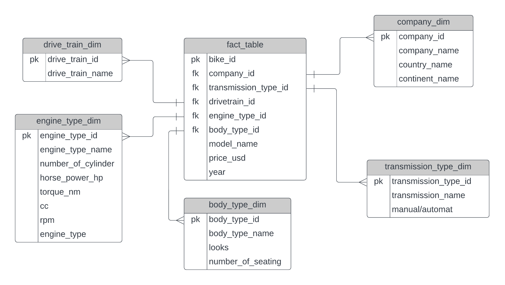

# Motorbike-data-engineering
The Motor Bike Data Engineering Project involved preprocessing, feature engineering, and analysis of a motor bike dataset, resulting in valuable insights presented through a Looker dashboard
# Data model

